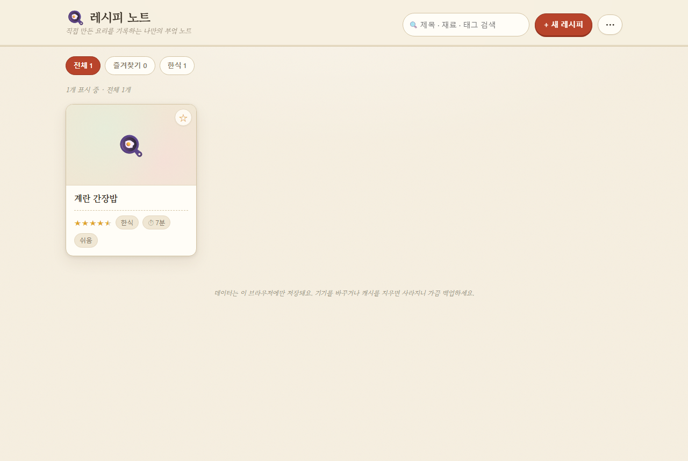
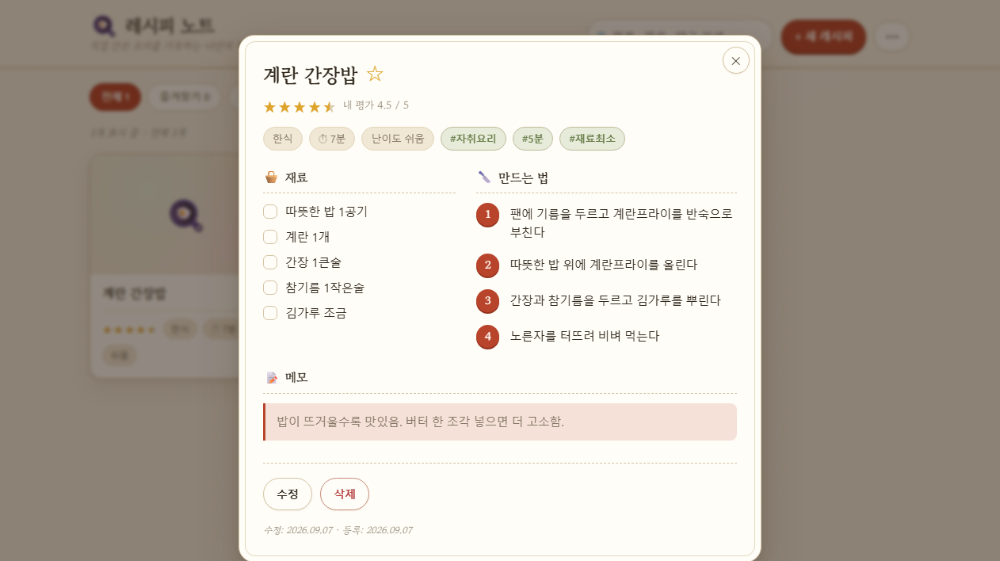

# 레시피 노트 🍳

> 직접 만든 요리를 기록하는, 나만의 부엌 노트

자취를 하다 보면 "그때 그거 어떻게 만들었더라?" 하는 순간이 자주 온다.
**레시피 노트**는 두 가지를 한곳에 둔 사이트다.

1. **자취 집밥 레시피 모음** — 재료가 적고 설거지가 덜 나오는 한식 위주 레시피를 직접 써서 올린 정적 콘텐츠 (`/recipes/`)
2. **개인용 레시피 메모장 앱** — 서버도 로그인도 없이 내 브라우저에만 저장되는 요리 기록장 (`index.html`)

레시피 글과 소개·개인정보처리방침 등 정적 페이지는 `content/` 의 데이터에서 생성기(`tools/build.mjs`)로 뽑아낸다.

<p align="center">
  
  
</p>

## ✨ 주요 기능

| 기능 | 설명 |
| --- | --- |
| **레시피 기록** | 제목 · 사진 · 카테고리 · 조리시간 · 난이도 · 태그 · 재료 · 만드는 법 · 메모 |
| **별점 (0.5 단위)** | 별을 누를 때마다 반 칸씩 채워짐. 목록만 훑어도 "만족했던 레시피"가 한눈에 |
| **재료 체크리스트** | 상세 화면에서 재료를 하나씩 체크하며 요리 (새로고침하면 초기화) |
| **검색 & 필터** | 제목 · 재료 · 태그 통합 검색, 카테고리별 · 즐겨찾기 필터 |
| **즐겨찾기** | 자주 만드는 레시피를 별표로 고정 |
| **사진 첨부** | 업로드 시 자동으로 1000px로 리사이즈 + JPEG 압축해 저장 공간 절약 |
| **JSON 백업 / 복원** | `⋯` 메뉴에서 전체 데이터를 내보내고 다시 불러오기 |
| **다크 모드** | OS 설정 자동 반영 |
| **반응형** | 주방에서 폰으로 보기 좋은 레이아웃 |

## 🛠 기술 스택

- **순수 HTML + CSS + JavaScript** — 런타임 프레임워크 없음
- **localStorage** — 앱의 모든 데이터는 브라우저에 저장, 서버 불필요
- **Node(빌드 전용)** — `tools/build.mjs` 가 `content/*.json` 과 `content/pages/*.html` 을 읽어
  레시피 상세·목록·정책 페이지·`sitemap.xml`·`robots.txt` 를 생성. 외부 의존성 0개
- **Google Fonts** — 명조 계열(Gowun Batang / Nanum Myeongjo)
- 개발용 `live-server`(자동 새로고침)

## 🚀 실행

```bash
# 정적 페이지 생성 (content/ → recipes/, *.html, sitemap.xml, robots.txt)
npm run build

# 로컬 미리보기 (빌드 후 서버 실행)
npm run dev        # http://localhost:8765  (자동 새로고침)
npm run start      # http://localhost:8765
```

> `npm install` 은 필요 없다. Node 18+ 만 있으면 된다.
> 생성물의 내부 링크는 상대경로라 `file://`, 로컬 서버, 하위 경로 어디서 열어도 동작한다.
> `canonical`·`sitemap.xml` 의 절대 주소만 `content/site.json` 의 `url` 을 따른다.

## 📦 배포

정적 사이트라 폴더를 그대로 올리면 된다.

- 저장소 → Settings → Pages → Source: `Deploy from a branch`, Branch: `main` / `/(root)`
- 서비스 주소: `https://hyunholee9204.github.io/Recipe_memo/`
- 콘텐츠를 고쳤다면 `npm run build` 후 생성물까지 함께 커밋한다.

## 🗂 프로젝트 구조

```
.
├── index.html          # 메모장 앱 (상세/편집용 <template> 포함)
├── styles.css          # 디자인 시스템, 다크 모드, 반응형 (앱 + 콘텐츠 공용)
├── app.js              # 앱 상태 관리 · 저장 · 렌더링 · 백업
├── site.js             # 콘텐츠 페이지 공용 스크립트
├── content/            # ── 콘텐츠 소스 (여기만 고치면 됨) ──
│   ├── site.json       #   사이트 이름 · 주소 · 내비게이션
│   ├── recipes.json    #   레시피 데이터 (제목·재료·순서·팁·FAQ …)
│   └── pages/          #   소개 / 개인정보처리방침 / 이용약관 / 문의 / 가이드 본문
├── tools/build.mjs     # 정적 페이지 생성기
├── recipes/            # ── 생성물 ── 레시피 상세 + 목록 (커밋됨)
├── about.html …        # ── 생성물 ── 소개·정책 페이지 (커밋됨)
├── sitemap.xml         # ── 생성물 ──
├── robots.txt          # ── 생성물 ──
└── docs/               # README용 스크린샷
```

## 📇 데이터 모델

```js
{
  id: string,
  title: string,
  category: string,      // 한식 / 양식 / 일식 / 중식 / 분식 / ...
  time: number | null,   // 조리시간(분)
  difficulty: string,    // 쉬움 / 보통 / 어려움
  tags: string[],
  ingredients: string[], // 한 줄에 하나
  steps: string[],       // 한 줄에 한 단계
  memo: string,
  rating: number,        // 0 ~ 5 (0.5 단위)
  image: string | null,  // data URL (JPEG)
  favorite: boolean,
  createdAt: number,
  updatedAt: number
}
```

localStorage 키: `recipe-note:v1`

## ⚠️ 데이터 보관 안내

레시피는 **접속한 브라우저에만** 저장된다.
캐시를 지우거나 기기를 바꾸면 사라지므로, `⋯` 메뉴의 **JSON 백업**을 가끔 받아 두는 것을 권장한다.

## 🧭 로드맵 (v2 아이디어)

- 냉장고에 있는 재료로 만들 수 있는 레시피 검색
- 여러 레시피를 골라 장보기 리스트 자동 생성
- 인분 수 조절 시 재료량 자동 계산
- 재료를 `이름 / 양` 구조로 분리해 저장

## 📄 라이선스

MIT — 개인 학습·활용 목적의 사이드 프로젝트입니다.
